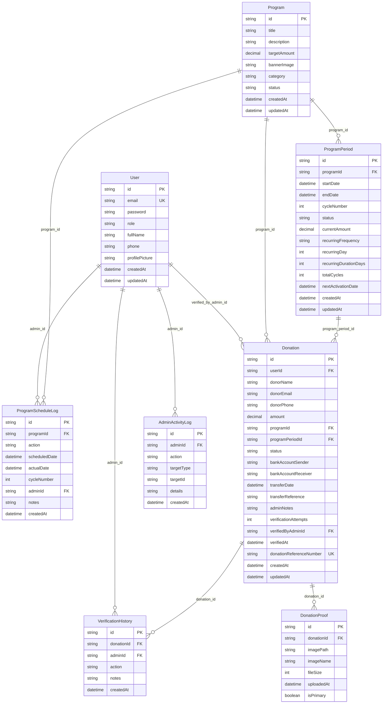

# BERJAMAAH APP - Database Schema Diagram

This diagram shows the complete database schema for the Berjamaah App Admin Panel, including all tables and their relationships.

## Entity Relationship Diagram

## Key Relationships Explained

### 1. **Program Management**

- `Program` → `ProgramPeriod` (1:many): One program can have multiple active periods
- `Program` → `Donation` (1:many): Donations are linked to programs for reference
- `ProgramPeriod` → `Donation` (1:many): Donations are specifically linked to active periods

### 2. **Donation Verification Workflow**

- `Donation` → `DonationProof` (1:many): Multiple proof images per donation
- `Donation` → `VerificationHistory` (1:many): Complete audit trail
- `User` → `Donation` (1:many): Admin verification tracking

### 3. **Admin Activity Tracking**

- `User` → `AdminActivityLog` (1:many): All admin actions logged
- `User` → `VerificationHistory` (1:many): Verification actions tracked
- `User` → `ProgramScheduleLog` (1:many): Program management actions

### 4. **Recurring Program System**

- `ProgramPeriod` stores recurring settings (frequency, day, duration)
- `ProgramScheduleLog` tracks all activation/deactivation events
- Automatic period creation based on recurring settings

## Database Design Philosophy

The schema separates program definition (`Program`) from program scheduling (`ProgramPeriod`), allowing for:

- Clean separation of concerns
- Easy querying of currently active programs
- Flexible recurring program management
- Accurate donation tracking per period
- Complete audit trails for compliance

## Table Descriptions

### Core Tables

**User**: Admin authentication and management

- Stores admin credentials and profile information
- Links to all admin activities for audit trails

**Program**: Master program information

- Contains program title, description, target amount
- Status management (draft, active, paused, ended)
- Category classification

**ProgramPeriod**: Active periods for donations

- Manages actual donation periods with start/end dates
- Handles recurring program settings
- Tracks current donation amounts per period

### Donation Management

**Donation**: Core donation records

- Stores donor information and donation details
- Links to both program and specific period
- Tracks verification status and admin notes

**DonationProof**: Bank transfer proof images

- Stores uploaded proof images
- Supports multiple images per donation
- Tracks file metadata and primary image flag

**VerificationHistory**: Complete audit trail

- Records all verification attempts
- Links admin actions to specific donations
- Maintains compliance documentation

### System Management

**ProgramScheduleLog**: Program activation tracking

- Logs all program activation/deactivation events
- Tracks scheduled vs actual activation times
- Maintains admin action history

**AdminActivityLog**: Comprehensive admin logging

- Records all admin actions across the system
- Supports different target types (donation, program)
- Provides complete system audit trail
